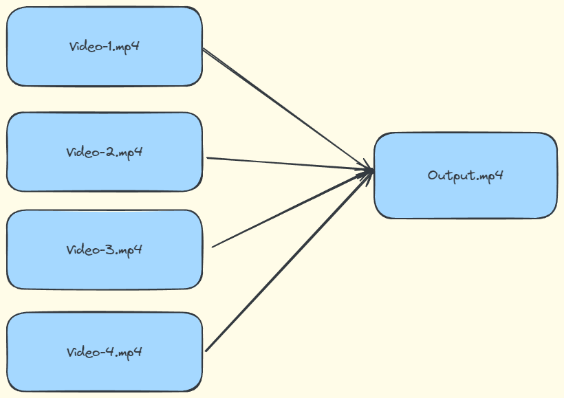
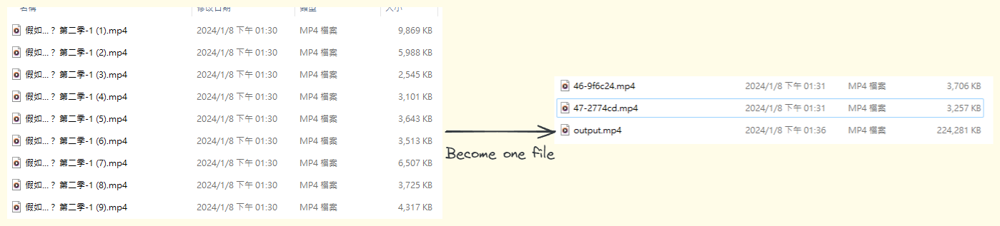

# video-merger
將一系列/一連串 (透過檔案時間 timestamp 進行排序) 的影片合併成一個檔案 (output.mp4)



## 動機
使用線上看的時候，觀看影片的速度相當不流暢，所以找了一個擴充功能 ([CoCoCut](https://chromewebstore.google.com/detail/%E5%BD%B1%E7%89%87%E4%B8%8B%E8%BC%89%E6%93%B4%E5%85%85-cococut/gddbgllpilhpnjpkdbopahnpealaklle?hl=zh-TW)) 把影片先下載下來在進行觀看，結果他會把影片變成一個一個片段，而不是一整部影片。
因此，這個工具就誕生了！

## 使用方法
### 需求
- node.js >= 18
- ffmpeg
### 安裝
```bash
npm i
```
### 執行
```bash
node index.js -i {videos-folder}
```

### 結果展示



## 過程解釋
- 掃描`輸入資料夾`所有的影片檔案 (`*.mp4,mov,avi,mkv`)
- 使用檔案修改時間進行排序
- 將檔案以 N-{uid} 重新命名
- 將檔案列表寫進 txt 檔案，讓 ffmpeg 可以讀取
- 透過 ffmpeg 指令合併影片
  ```bash
  ffmpeg -f concat -safe 0 -i list.txt -c copy output.mp4
  ```
  

